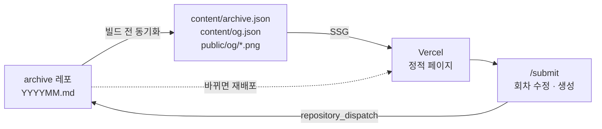

# Frontend Archive

3~5년차 주니어 개발자 넷이 회차마다 각자 쓴 글을 모아 두는 곳입니다.

글은 각자 자기 블로그에 씁니다. 이 사이트는 글을 담아 두지 않고 어디에 무엇이 있는지만 압니다. 회차가 끝나면 [`Frontend-Archive/archive`](https://github.com/Frontend-Archive/archive) 레포의 `archives/YYYYMM.md` 에 제목·링크·태그를 적고, 그 마크다운이 이 사이트의 유일한 원본입니다.

## 어떻게 굴러가나



원본은 archive 레포의 마크다운 하나뿐입니다. 빌드할 때 그걸 내려받아 정적 페이지로 굳히고, 그 뒤로는 정적 파일만 서빙합니다. 읽는 쪽에 DB도 API도 없습니다.

## 기능

### 1. 글 읽기

- 아티클 목록과 상세
- `⌘K` 검색 팔레트
- 태그 · 타임라인 · 멤버
- OG 이미지가 없으면 대체 썸네일
- 모바일 전용 하단 내비와 목록 줄 카드

### 2. 읽은 기록

브라우저에만 남습니다.

- 읽은 글은 썸네일 색이 빠짐
- 최근 읽은 글을 날짜별로
- 안 읽은 글만 보기

### 3. 글 관리

GitHub 로그인 후 화면에서 회차를 수정하거나 새로 만듭니다. 마크다운은 직접 쓰지 않고 `repository_dispatch` 로 넘겨 archive 레포 워크플로가 씁니다.

이 페이지에만 환경변수가 필요합니다 — [`.env.example`](.env.example) 참고.

## 멤버 추가하기

명부는 [`src/lib/archive/members-config.ts`](src/lib/archive/members-config.ts) 하나뿐입니다. 로그인 허용 여부, 화면에 나오는 이름, 주소, 아바타가 전부 여기서 나옵니다.

```ts
{
  id: 'kwonsean',                          // 고정 식별자. 주소와 아바타 파일 이름
  name: '권시현',                          // archive 에 적히는 이름
  github: 'kwonsean',                      // 프로필 사진과 로그인 허용
  blog: 'https://kwonsean.tistory.com',    // 없으면 생략
}
```

명부에 없는 이름이 archive 에 등장하면 빌드가 멈춥니다.

## 이름 바꾸기

같은 [`members-config.ts`](src/lib/archive/members-config.ts) 에서 `name` 을 새 이름으로 고치고, 옛 이름을 `aliases` 에 남깁니다.

```ts
{
  id: 'seung1',
  name: '승원',
  aliases: ['최승원'],
  github: 'seung1',
}
```

`id` 는 그대로 두어야 합니다. 예전 회차의 글도 같은 사람으로 이어지고, 주소(`/members/seung1`)와 아바타 파일도 유지됩니다.

## 변경이 반영되는 과정

### 이 레포에 푸시하면

1. CI가 lint·typecheck·format·build 를 돌립니다.
2. `main` 이면 Vercel이 배포를 시작합니다.
3. 빌드 전에 archive 레포의 마크다운과 OG 메타·아바타를 내려받습니다.
4. 그 데이터로 정적 페이지를 만들어 올립니다.

### `/submit` 에서 수정·생성을 누르면

1. archive 레포로 `add-article` dispatch 를 보냅니다. 무엇을 바꿀지만 담깁니다.
2. archive 레포 워크플로가 `YYYYMM.md` 를 고쳐 커밋합니다.
3. 그쪽에서 `archive-updated` 를 되쏘면 [`redeploy.yml`](.github/workflows/redeploy.yml) 이 받아 Vercel 배포 훅을 겁니다.
4. 다시 빌드되면서 바뀐 마크다운을 내려받아 사이트에 반영됩니다.
